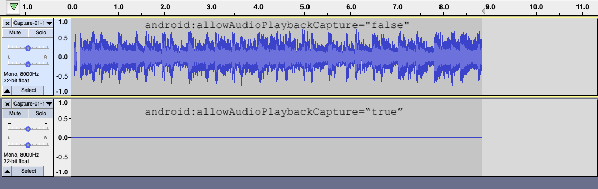

# AudioCaptureSample

Sample app for Android 10's AudioPlaybackCapture API, which allows applications to capture the audio of other applications.

This app serves as a showcase for how to request the proper permissions and architect an application by using a foreground service that wraps the audio sample data capturing. You can also use it to ensure your application behaves properly when targetting API level 29 and above.



Check the [official API release blog post](https://android-developers.googleblog.com/2019/07/capturing-audio-in-android-q.html) for more information on how to allow/disallow apps from recording your apps' media output.

### Usage

Tapping the "Capture audio" button on the UI will present two permission requests:
 - [record audio permission](https://developer.android.com/reference/android/Manifest.permission#RECORD_AUDIO)
 - [media projection permission](https://developer.android.com/reference/android/media/projection/MediaProjectionManager#createScreenCaptureIntent())

Once both are granted, a foreground service (with an attached status bar notification) will be started, spawning a thread that performs the audio sample capturing. For the sake of the example, these samples have hardcoded characteristics in the [configuration object](https://github.com/julioz/AudioCaptureSample/blob/master/app/src/main/java/com/zynger/audiocapturesample/AudioCaptureService.kt#L91-L95):
 - Sample rate of 8000 Hz
 - Mono channel
 - No encoding: PCM 16-bit (byte-order: little endian)

Until the "Stop capture" button is tapped, the samples are written to a file in disk under the `/data` directory of the showcase application. The path to the written file will be outputted to LogCat, like so
```
D/AudioCaptureService: Audio capture finished for /storage/emulated/0/Android/data/com.zynger.audiocapturesample/files/AudioCaptures/Capture-01-10-2019-05-21-22.pcm. File size is 395264 bytes.
```

You can then pull the file from the device and play the media back. Make sure you use a player that is capable of rendering raw PCM data (for example, on [Audacity](https://www.audacityteam.org/download/), you can `File > Import > Raw Data`).


